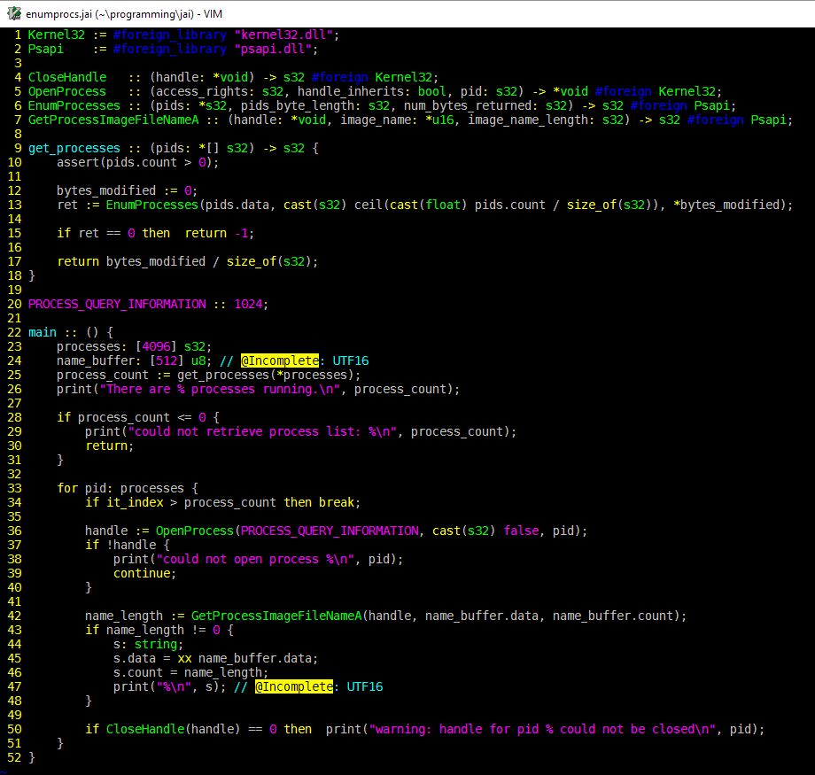

# jai.vim
Derivation of [jansedivy's jai.vim](https://github.com/jansedivy/jai.vim); highlighting for Jonathon Blow's programming language, 
[Jai](https://www.youtube.com/playlist?list=PLmV5I2fxaiCKfxMBrNsU1kgKJXD3PkyxO).

### What it looks like. (In cmd.exe, anyway.)

### Installation

Simply clone the repository into your Vim's package directory.
If using [Pathogen](https://github.com/tpope/vim-pathogen), clone it into the `bundle` folder within Vim's package directory, instead.

Note that the package directory is located in `%USERPROFILE%\vimfiles` on Windows,
and `~/.vim` on Unix.